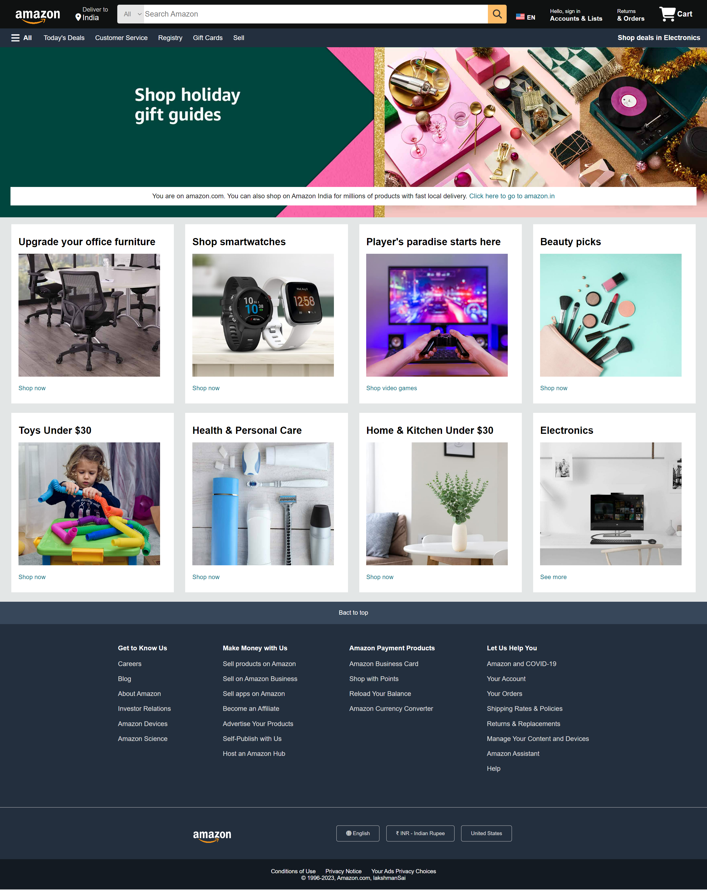

# Amazon-Clone-Using-HTML-CSS

This is a simple Amazon India clone created using HTML and CSS, aimed at replicating the basic functionalities and design elements of the Amazon India website. This project serves as a demonstration of front-end development skills and an understanding of web design principles.

## Source Website
Check out the live demo of the Amazon India website [here](https://www.amazon.com/).

## Demo
Check out the screenshot of my Amazon India Clone (you may not be able to see the image due to network issues; in such cases, do check out "demo.png" in the same repo):
.

## To run this project locally, follow these steps:

1. Clone this repository to your local machine using git clone https://github.com/Pala-LakshmanSai/Amazon-Clone-Using-HTML-CSS.git
2. Navigate to the project directory.
3. Open the index.html file in your web browser.

 ***Open for Contributions :)***
